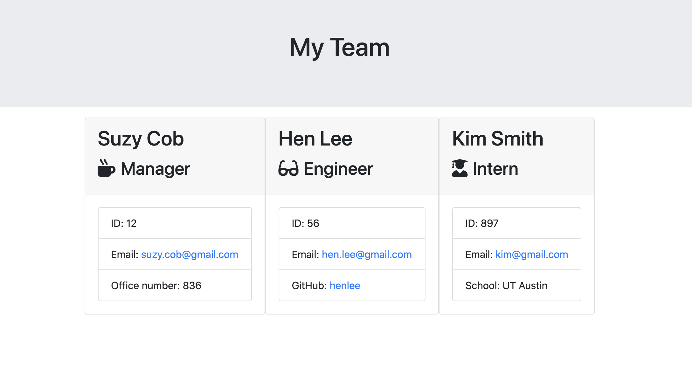
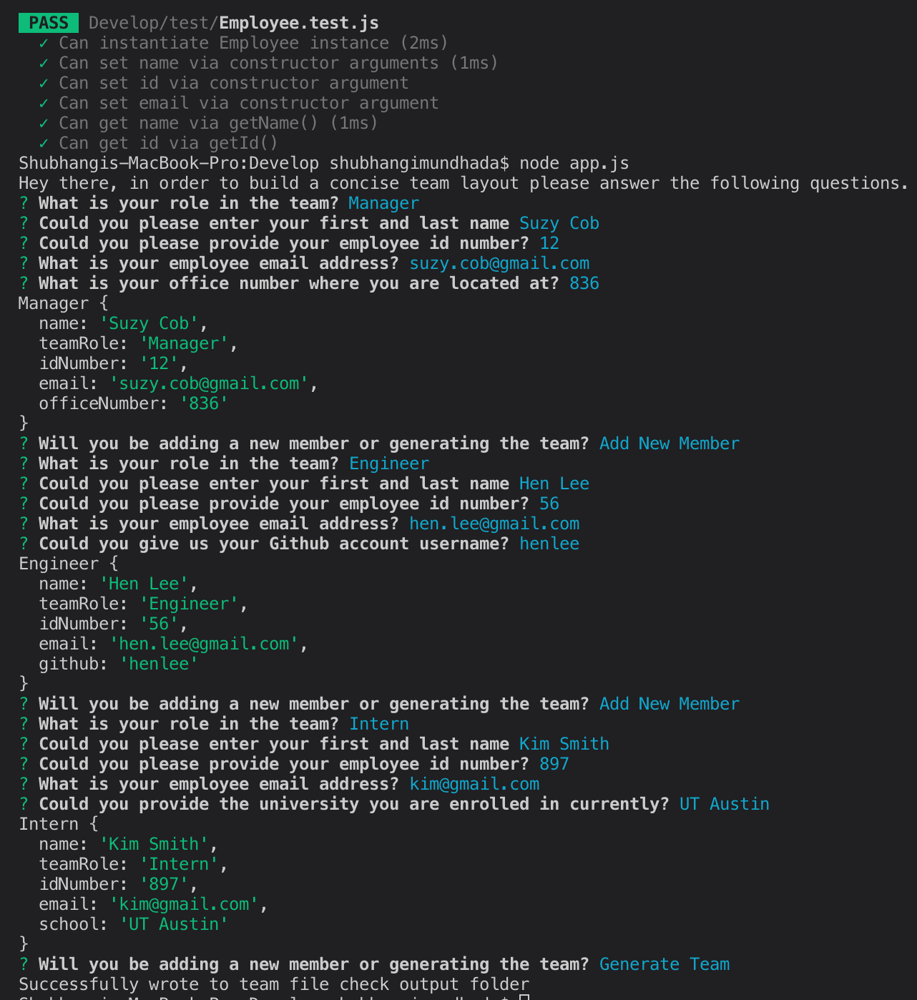

# TeamGenerator
---

## Table of Contents
---
* [Description](#Description)
* [Installation](#Installation)
* [Usage](#Usage)
* [Contributors](#Contributors)
* [Test](#Test)
* [License](#License)
* [Questions](#Questions)

## Description
---
This project is made so that user can generate a concise overview of their team. The user will be asked to input some values about their team and them themselves. The inputs on the role questing determine whether to give which  other set of questions. Once every member is filled in their information a html document is created, display all the team member and their id, email, role, name and something different that makes them stand out. 

## Installation 
---
npm install node when you download the file, this way all the required packages will be loaded into your project to be used. 

## Usage 
---
In order to run the project just type in node app.js and answer quick question and a team file will be generated. 

## Contributors
---
Shubhangi Mundhada

## Test
---
Jest

## License
---
MIT

## Questions
---
Github Link - https://github.com/smundhada
Email - shubhimundhada@gmail.com

